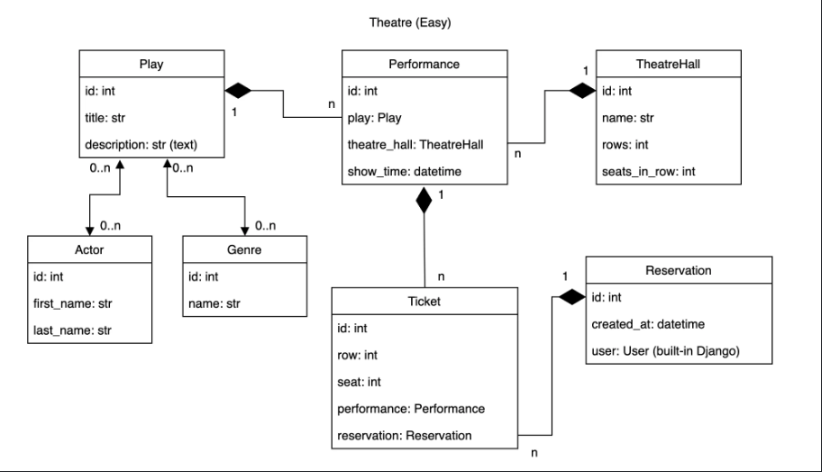

# Theater API 🎭🎟️
This theater API service allows users to book tickets online and select seats without visiting the box office. It simplifies the purchasing process by providing up-to-date information on available shows, schedules, prices, and vacant seats.

# Project Structure



# Main Features ✨

* API Endpoints for managing:
* Performances
* Shows and Screenings
* Tickets
* Users
* User Authentication:
* User registration
* JWT authentication
* API Documentation - Redoc and Swagger
* Database Management - PostgreSQL
* Containerized Deployment - Docker and Docker Compose

# Technologies Used ⚙️

* Backend: Python 3.12, Django 5.1.4, Django REST Framework
* Database: PostgreSQL
* Authentication: Simple JWT
* Containerization: Docker, Docker Compose
* Environment Management: Poetry, Python-dotenv

# Getting Started 🐾

## Prerequisites

* Python 3.12+
* Poetry
* Docker and Docker Compose
* Make

## Local Setup

### 1. Clone the Repository
```bash
git clone https://github.com/AchillesPython/Theater-service.git
cd theater-api
```

### 2. Create a .env File

Fill in the .env file, use .env.template as a reference to that.

### 3. Install Dependencies

Run the following command to install dependencies using Poetry:
```bash
poetry install
```

### 4. Apply Migrations

Run database migrations:
```bash
make migrate
```

### 5. Start the Development Server

Start the Django development server:
```bash
make runserver
```
The server will be available at http://127.0.0.1:8000.
